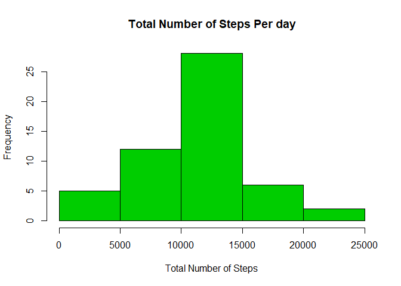
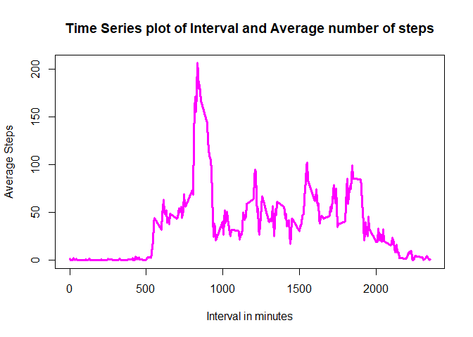
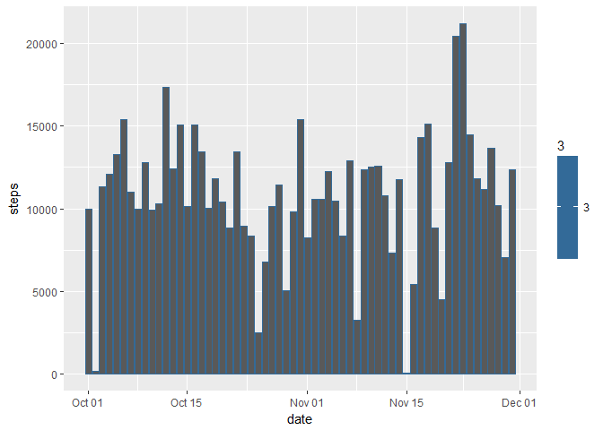
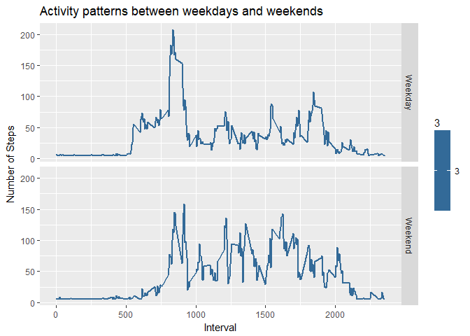

# Reproducible Research: Peer Assessment 1


## Loading and preprocessing the data


```r
library(data.table)
Activity <- fread("activity.csv ", na.strings = "NA", header = T)
str(Activity) #Looking at the structure of the table
```

```
## Classes 'data.table' and 'data.frame':	17568 obs. of  3 variables:
##  $ steps   : int  NA NA NA NA NA NA NA NA NA NA ...
##  $ date    : chr  "2012-10-01" "2012-10-01" "2012-10-01" "2012-10-01" ...
##  $ interval: int  0 5 10 15 20 25 30 35 40 45 ...
##  - attr(*, ".internal.selfref")=<externalptr>
```

```r
#Change the date datatype
Activity$date <- as.Date(Activity$date)

# add col weekday
Activity$weekday <- weekdays(Activity$date, abbreviate = T)

#Add Col for WeekType
Activity$DayType <- ifelse(Activity$weekday == "Sat"| Activity$weekday == "Sun", "Weekend","Weekday")

head(Activity, 3) #looking at the first three observations
```

```
##    steps       date interval weekday DayType
## 1:    NA 2012-10-01        0     Mon Weekday
## 2:    NA 2012-10-01        5     Mon Weekday
## 3:    NA 2012-10-01       10     Mon Weekday
```


## What is mean total number of steps taken per day?
### For this part of the assignment, you can ignore the missing values in the dataset.

1. Calculate the total number of steps taken per day
2. Make a histogram of the total number of steps taken each day


```r
TotalStepsperday <- aggregate(steps~ date, Activity, sum )
names(TotalStepsperday)<- c("date", "Total_Steps")

hist(TotalStepsperday$`Total_Steps`,main = "Total Number of Steps Per day", xlab = "Total Number of Steps", col = 3)
```

<!-- -->

### 4. Calculate and report the mean and median of the total number of steps taken per day


```r
mean <-mean(TotalStepsperday$Total_Steps)
Median <-median(TotalStepsperday$Total_Steps)
```


### The Total mean steps per day is 1.0766189\times 10^{4} and median steps per day is 10765


## What is the average daily activity pattern?

```r
Avg <- aggregate(Activity$steps, by= list(Activity$interval), mean, na.rm = TRUE)
names(Avg) <- c("Interval", "Mean")
head(Avg)
```

```
##   Interval      Mean
## 1        0 1.7169811
## 2        5 0.3396226
## 3       10 0.1320755
## 4       15 0.1509434
## 5       20 0.0754717
## 6       25 2.0943396
```


### Make a time series plot (i.e. type = "l") of the 5-minute interval (x-axis) and the average number of steps taken, averaged across all days (y-axis)


```r
#PLOT
plot(Avg$Mean ~Avg$Interval, 
     type= "l", col= 6,lwd = 3,
     xlab = "Interval in minutes", ylab = "Average Steps", main = "Time Series plot of Interval and Average number of steps")
```

<!-- -->


### Which 5-minute interval, on average across all the days in the dataset, contains the maximum number of steps?


```r
max <- which(Avg$Mean == max(Avg$Mean))
maxpos <- Avg[max,1]
```


### The 5-minute interval that contains the maximum of steps on average across all days is 835


## Imputing missing values


### Calculate and report the total number of missing values in the dataset (i.e. the total number of rows with NAs)


```r
Missing <-subset(Activity, is.na(steps))
dim(Missing) #Number of missing
```

```
## [1] 2304    5
```

```r
summary(Activity)
```

```
##      steps             date               interval        weekday         
##  Min.   :  0.00   Min.   :2012-10-01   Min.   :   0.0   Length:17568      
##  1st Qu.:  0.00   1st Qu.:2012-10-16   1st Qu.: 588.8   Class :character  
##  Median :  0.00   Median :2012-10-31   Median :1177.5   Mode  :character  
##  Mean   : 37.38   Mean   :2012-10-31   Mean   :1177.5                     
##  3rd Qu.: 12.00   3rd Qu.:2012-11-15   3rd Qu.:1766.2                     
##  Max.   :806.00   Max.   :2012-11-30   Max.   :2355.0                     
##  NA's   :2304                                                             
##    DayType         
##  Length:17568      
##  Class :character  
##  Mode  :character  
##                    
##                    
##                    
## 
```

## The total number of missing is 2304 as seen from the summary statistics

### 2. Devise a strategy for filling in all of the missing values in the dataset. The strategy does not need to be sophisticated. For example, you could use the mean/median for that day, or the mean for that 5-minute interval, etc.


```r
MeanPerDay <- aggregate(Activity$steps, by=list(Activity$weekday), mean, na.rm =TRUE)
names(MeanPerDay) <- c("Day","MeanSteps")
MeanPerDay
```

```
##   Day MeanSteps
## 1 Fri  42.91567
## 2 Mon  34.63492
## 3 Sat  43.52579
## 4 Sun  42.63095
## 5 Thu  28.51649
## 6 Tue  31.07485
## 7 Wed  40.94010
```

## 3. Create a new dataset that is equal to the original dataset but with the missing data filled in.


```r
library(dplyr)
```

```
## 
## Attaching package: 'dplyr'
```

```
## The following objects are masked from 'package:data.table':
## 
##     between, first, last
```

```
## The following objects are masked from 'package:stats':
## 
##     filter, lag
```

```
## The following objects are masked from 'package:base':
## 
##     intersect, setdiff, setequal, union
```

```r
New <- Activity %>%
  group_by(weekday)%>%
  mutate(steps = ifelse(is.na(steps),mean(steps,na.rm = TRUE), steps))
summary(New)
```

```
##      steps             date               interval        weekday         
##  Min.   :  0.00   Min.   :2012-10-01   Min.   :   0.0   Length:17568      
##  1st Qu.:  0.00   1st Qu.:2012-10-16   1st Qu.: 588.8   Class :character  
##  Median :  0.00   Median :2012-10-31   Median :1177.5   Mode  :character  
##  Mean   : 37.57   Mean   :2012-10-31   Mean   :1177.5                     
##  3rd Qu.: 34.63   3rd Qu.:2012-11-15   3rd Qu.:1766.2                     
##  Max.   :806.00   Max.   :2012-11-30   Max.   :2355.0                     
##    DayType         
##  Length:17568      
##  Class :character  
##  Mode  :character  
##                    
##                    
## 
```


## 4. Make a histogram of the total number of steps taken each day and Calculate and report the mean and median total number of steps taken per day. 


```r
# Total Steps per day
TotStepsDay <- aggregate(New$steps, by=list(New$date), sum)
names(TotStepsDay) <- c("date", "steps")

#PLOT
library(ggplot2)
ggplot(TotStepsDay, aes( x= date, y= steps, col= 3))+ 
  geom_histogram( stat= "identity", binwidth = 1)+
  labs(main=" A histogram of the total number of steps taken each day ", 
       xlab= "Total Steps",ylab="Date")
```

```
## Warning: Ignoring unknown parameters: binwidth, bins, pad
```

<!-- -->


### Calculate and report the mean and median total number of steps taken per day. 


```r
newMean <- mean(TotStepsDay$steps)
newMedian <- median(TotStepsDay$steps)
```


### The Median of the new data is 1.1015\times 10^{4} and the Mean is 1.082121\times 10^{4}

## 5. Do these values differ from the estimates from the first part of the assignment? What is the impact of imputing missing data on the estimates of the total daily number of steps?

* The Values do not differ significantely, but they do differ

## Are there differences in activity patterns between weekdays and weekends?

Create a new factor variable in the dataset with two levels - "weekday" and "weekend" indicating whether a given date is a weekday or weekend day.


```r
New$DayType <- factor(New$DayType)
str(New$DayType)
```

```
##  Factor w/ 2 levels "Weekday","Weekend": 1 1 1 1 1 1 1 1 1 1 ...
```

```r
AvStepPerInterval <- aggregate(New$steps, by=list(New$interval,New$DayType), mean )

names(AvStepPerInterval) <- c("Interval", "DayType", "steps")
```

### Make a panel plot containing a time series plot (i.e. type = "l") of the 5-minute interval (x-axis) and the average number of steps taken, averaged across all weekday days or weekend days (y-axis). See the README file in the GitHub repository to see an example of what this plot should look like using simulated data.


```r
ggplot(AvStepPerInterval , aes(Interval,steps, col= 3))+ 
  geom_line(lwd=1)+ 
  facet_grid(DayType~.)+
  labs(title = "Activity patterns between weekdays and weekends", y ="Number of Steps")
```

<!-- -->


